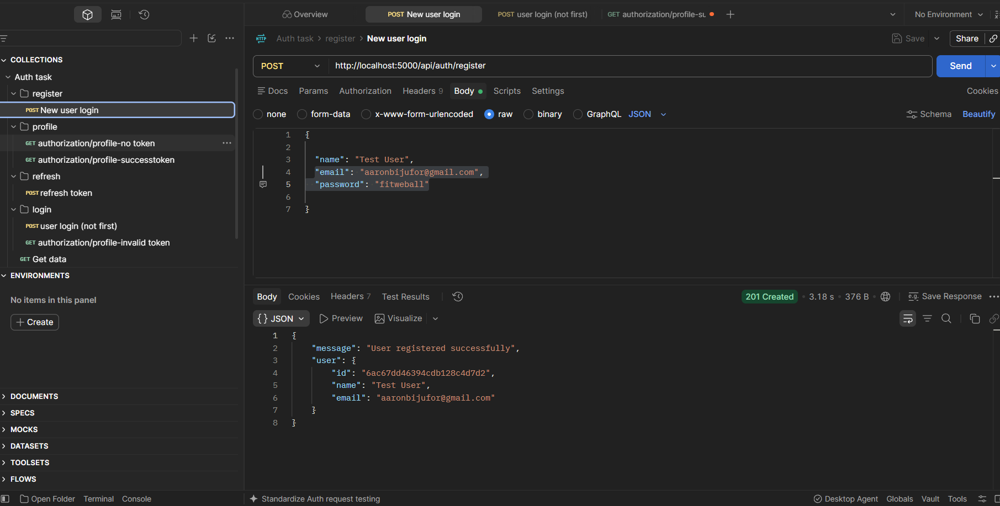
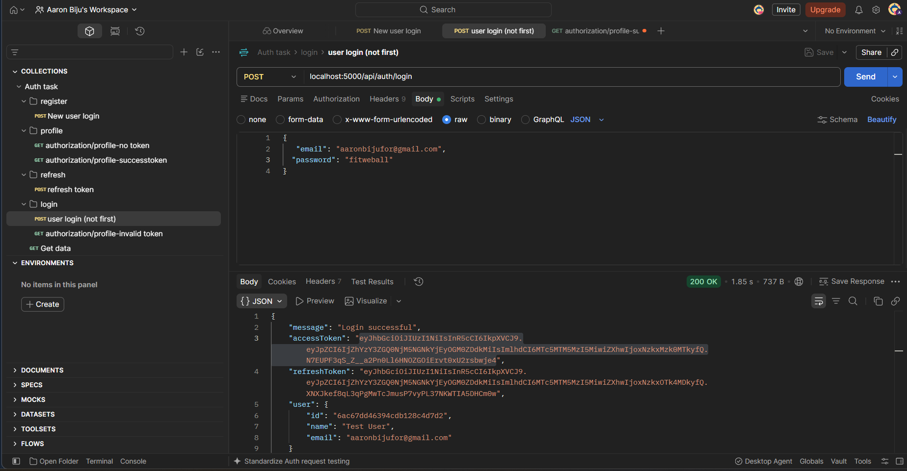
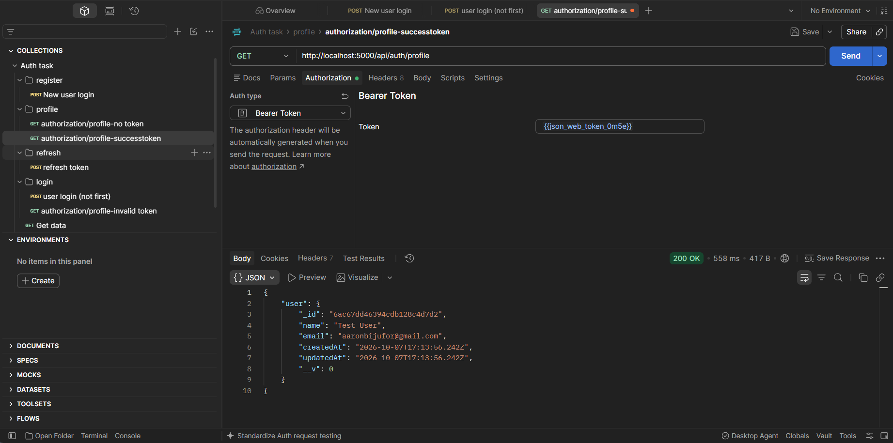

# Auth System (Node.js + Express + MongoDB)

A secure user authentication API with JWT access/refresh tokens,
password hashing, protected routes, and email notifications.

## Features

- User registration and login
- Password hashing with bcryptjs
- JWT access and refresh tokens
- Auth middleware for protected routes
- Welcome and login emails via Nodemailer
- MVC architecture

## Tech Stack

Node.js, Express, MongoDB Atlas, Mongoose, bcryptjs, jsonwebtoken, Nodemailer

## Project Structure

(paste your folder tree here)

## Setup

1. Clone the repo
2. Run `npm install`
3. Create a `.env` file (see `.env.example`)
4. Run `npm run dev`

## Environment Variables

| Variable             | Description                     |
| -------------------- | ------------------------------- |
| PORT                 | Server port                     |
| MONGO_URI            | MongoDB Atlas connection string |
| ACCESS_TOKEN_SECRET  | Secret for access tokens        |
| REFRESH_TOKEN_SECRET | Secret for refresh tokens       |
| EMAIL_USER           | Gmail address                   |
| EMAIL_PASS           | Gmail app password              |

## API Endpoints

| Method | Endpoint           | Auth         | Description            |
| ------ | ------------------ | ------------ | ---------------------- |
| POST   | /api/auth/register | No           | Register a user        |
| POST   | /api/auth/login    | No           | Login, returns tokens  |
| GET    | /api/auth/profile  | Bearer token | Get current user       |
| POST   | /api/auth/refresh  | No           | Get a new access token |

(For each endpoint: add a sample request body, sample response, and the screenshot.)

## Testing

**Register a new user** (`POST /api/auth/register`, expect `201`)

**Login with an existing user** (`POST /api/auth/login`, expect `200` with tokens)

**Access the protected route with a token** (`GET /api/auth/profile`, expect `200`)
